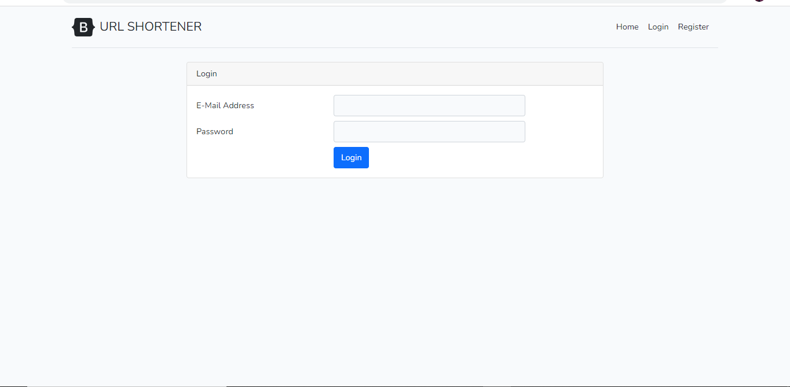

## URL Shortener
Simple Laravel and Vue.js Application for URL shortening, that demonstrate use of VueJs.
URL shortening is used to create shorter aliases for long URLs. We call these shortened aliases “short links.” Users are redirected to the original URL when they hit these short links. The Url Shortener app is made with Laravel Framework 8 and Vue js 3.

## Screenshots




##How To Use
- Clone your project
- Go to the folder application using `cd` command on your cmd or terminal
- Run `composer install` on your cmd or terminal
- Copy `.env.example` file to `.env` on the root folder. You can type `copy .env.example .env` if using command prompt Windows or `cp .env.example .env` if using terminal, Ubuntu
- Open your `.env` file and change the database name (`DB_DATABASE`) to whatever you have, username (`DB_USERNAME`) and password (`DB_PASSWORD`) field correspond to your configuration.
- Run `php artisan key:generate` to generate key for this laravel project
- Run `php artisan migrate` to migrate database tables
- Run `php artisan serve` to run the 
- Go to link `localhost:8000` OR `127.0.0.1:8000`

#### Clone the repository

```bash
git clone
```

#### Copy `.env.example` file to `.env` on the root folder. You can type `copy .env.example .env` if using command prompt Windows or `cp .env.example .env` if using terminal, Ubuntu

#### Install Via Composer

```bash
composer install
```

#### Generate Application Key

```bash
php artisan key:generate
```

#### Migrate Database

```bash
php artisan migrate
```

#### Run Seeder

```bash
php artisan db:seed
```

#### Install Dependencies

```bash
npm install
npm run dev
```

#### Go to link `localhost:8000` OR `127.0.0.1:8000`

