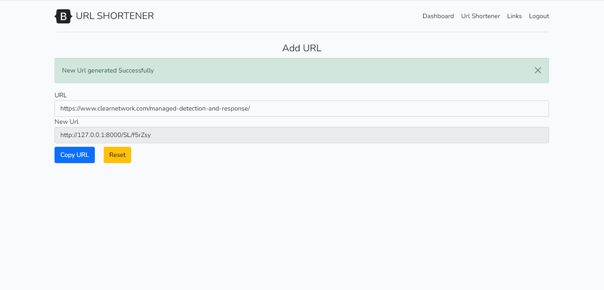

## URL Shortener
Simple Laravel and Vue.js Application for URL shortening, that demonstrate use of VueJs.
URL shortening is used to create shorter aliases for long URLs. We call these shortened aliases “short links.” Users are redirected to the original URL when they hit these short links. The Url Shortener app is made with Laravel Framework 8 and Vue js 3.

## Screenshots





## Installation Guide

`Laravel 8` requires `PHP 7.3+` or above so you need this version or the latest version of PHP installed on your system.

#### Clone the repository

```bash
git clone
```

#### Copy `.env.example` file to `.env` on the root folder. You can type `copy .env.example .env` if using command prompt Windows or `cp .env.example .env` if using terminal, Ubuntu

#### Install Via Composer

```bash
composer install
```

#### Generate Application Key

```bash
php artisan key:generate
```

#### Migrate Database

Open your `.env` file and change the database name (`DB_DATABASE`) to whatever you have, username (`DB_USERNAME`) and password (`DB_PASSWORD`) field correspond to your configuration. After db config run the following command.

```bash
php artisan migrate
```

#### Install Dependencies

```bash
npm install
```

#### Generate Google safe browsing API key

Generate and configure API key on `.env` file. [Documents](https://kb.synology.com/en-uk/SRM/tutorial/How_to_generate_Google_Safe_Browsing_API_keys) for generating google safe browsing API key.
```bash
GOOGLE_API_KEY=your_google_safe_browsing_API_key
```

#### Run Project

Terminal one:
```bash
npm run dev
```
Terminal Two:
```bash
php artisan serve
```

#### Go to link `localhost:8000` OR `127.0.0.1:8000`


## Test URLs

Here are some handy test urls you can use while you're experimenting with the system.

- http://www.yahoo.com/ (OK)
- http://www.google.com/ (OK)
- http://malware.testing.google.test/testing/malware/ (Malware)
- http://twitter.com/ (OK)

